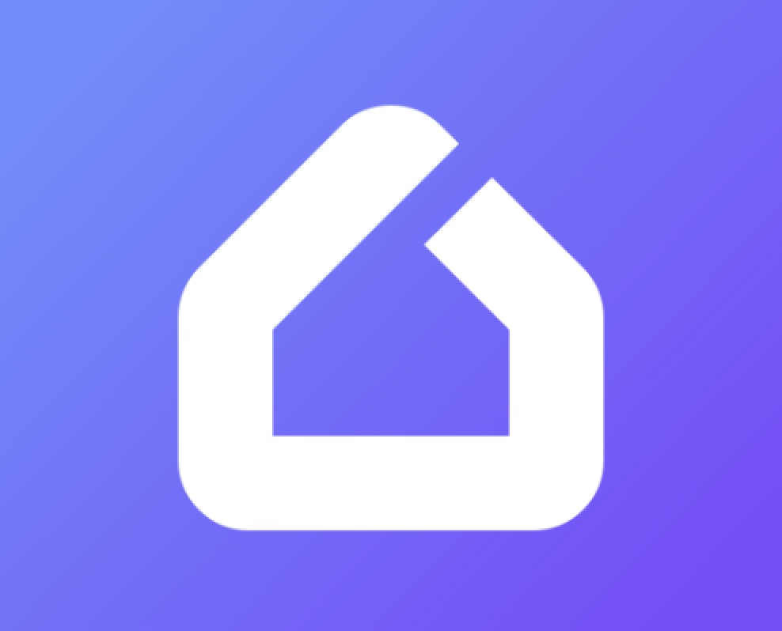

# My Home Hub

A home-running server that controls, stores, and provides information about IoT devices and other home services. The hub communicates with devices via multiple protocols (MQTT, Tuya API, HTTP) and provides a REST API for control and monitoring.

## Overview

- **Multi-Protocol Device Support**: Control devices via MQTT, Tuya local API, HTTP, and Google Cast
- **Device Brands**: ESP32 (custom MQTT devices using [SmartHomeDevices](https://github.com/IlyaMatsuev/SmartHomeDevices) library), Tuya, Shelly, Google Speakers
- **Automation Scenarios**: Create automation rules with cron schedules and device state triggers
- **Secure Authentication**: JWT-based authentication with TOTP for user registration
- **REST API**: Full device management through REST endpoints with Swagger documentation
- **Discoverable**: The hub can be discovered in the Wi-Fi network by sending a UDP request

## Prerequisites

- Node.js >= 20.0.0
- npm >= 10.0.0
- Docker and Docker Compose

## 🚀 Build & Run

1. Install Dependencies: `npm install`
2. Start Infrastructure Services

- Start MongoDB (via Docker): `npm run mongo:start`
- Start MQTT broker (via Docker): `npm run mqtt:start`

3. Start the Application

- Start in development mode with hot-reload: `npm run start:dev`
- Start in production mode (via Docker): `npm run start`

4. Run all unit tests: `npm test`

## 🛠️ Configuration

The application uses env file `.env`, which can be created from the [`.env.example`](../.env.example): `cp .env.example .env`

## 📝 Documentation

- [General project documentation](docs)
- [Postman API collection](api)
- Swagger API documentation available at `/api` endpoint when the server is running

## ❓ Questions

If you have any questions you can start a discussion.
If you think something works not as expected or you want to request a new feature, you can create an issue with the appropriate template selected.

## 🤝 Contributing

Pull requests are welcome.
For major changes, please open an issue first to discuss what you would like to change.
Please make sure to update tests as appropriate.

## 🎫 License

[MIT](LICENSE)
